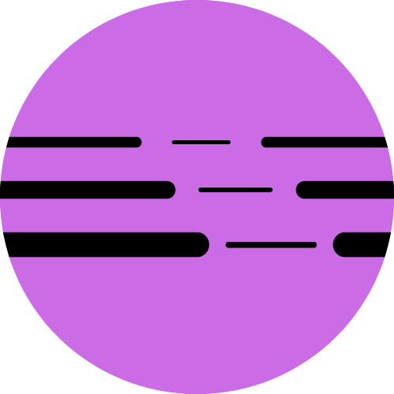

  

# deepdiver.ml Inference Gateway
Backend service exposing API to access our services.

# Code
Application is written in asp.net core 7 and utilizes hexagonal architecture.

# Capabilites
Our gateway exposes REST, GraphQL and gRCP endpoints. It utilizes various caching strategies to make inferences as fast as possible.